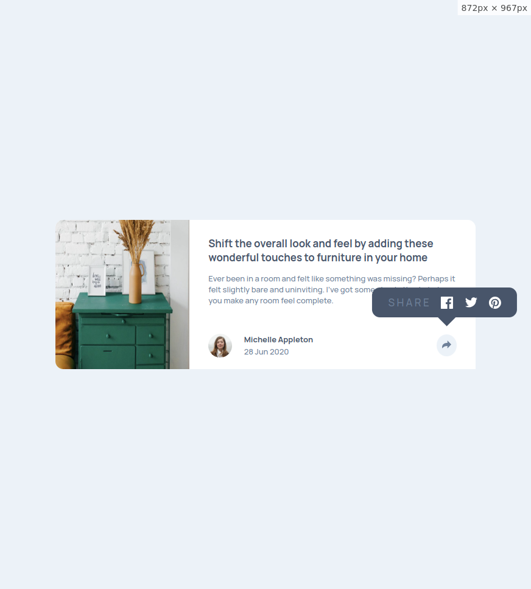

# Frontend Mentor - Article preview component solution

This is a solution to the [Article preview component challenge on Frontend Mentor](https://www.frontendmentor.io/challenges/article-preview-component-dYBN_pYFT). Frontend Mentor challenges help you improve your coding skills by building realistic projects. 

### The challenge

Users should be able to:

- View the optimal layout for the component depending on their device's screen size
- See the social media share links when they click the share icon

### Screenshot

### Links

- Solution URL: [github](https://github.com/mostafa-hsh/Article-preview-component)
- Live Site URL: [github pages](https://mostafa-hsh.github.io/Article-preview-component/)

### Built with

- Semantic HTML5 markup
- Flexbox
- Mobile-first workflow
- vanilla js

## Author

- Frontend Mentor - [@mostafa-hsh](https://www.frontendmentor.io/profile/mostafa-hsh)
thanks FRONTEND-MENTOR